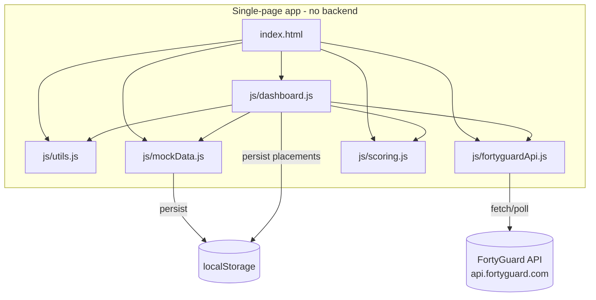

# GroceryStoreTemperatureScore
# Grocery Store Temperature Withstanding Score Dashboard

YouTube url : https://www.youtube.com/watch?v=Nt143iqLzfY

A pure HTML / CSS / vanilla JavaScript prototype that measures a **Store Temperature
Withstanding Score** — an estimate of how many days a product can stay in good condition
at a specific shelf position, based on its own temperature tolerance, the temperature of
neighboring products, and the store's ambient temperature (sourced from the FortyGuard
environmental API).

No build step, no framework, no backend — open [`index.html`](index.html) directly in a browser.
The only third-party dependency is [Chart.js](https://www.chartjs.org/) loaded from a CDN for
the visualization widgets.

---

## 1. Objective

> How many days can a product stay in good condition if it is placed at a particular
> position in a store, given its own temperature, the influence of neighboring products,
> and the store's ambient temperature?

The tool answers this per-product, rolls it up to a per-store score, lets you change a
product's shelf position and see the score update live, and suggests future placements
with an illustrative profit uplift estimate.

## 2. Business Benefits

- **Reduce shrink/spoilage loss** — flag products that are at risk of degrading before
  they sell, before it happens, instead of after a write-off.
- **Optimize planogram decisions** — quantify the freshness cost of a shelf position
  instead of relying on gut feel.
- **Proactive weather-driven merchandising** — because the score is date-aware and pulls
  forward-looking temperature data, staff can re-plan shelf layouts for a heatwave 5-10
  days out.
- **Profit-aware suggestions** — placement recommendations are expressed in the same
  terms a category manager thinks in: *"If Milk is kept at 20°C at position (10,2,3) on
  Sept 2, it can yield an estimated profit of 5%."*

## 3. Functional View

| Area | Description |
|---|---|
| **Filters** | Pick a store, filter products by category or search by name. |
| **KPI cards** | Store withstanding score (sum of all product withstand-days), product count, at-risk count, today's ambient temperature. |
| **Temperature trend chart** | Last 15 days + next 10 days of ambient temperature for the selected store (green marker = today). |
| **Withstand-days chart** | Per-product bar chart for the selected store, color-coded by risk. |
| **Store leaderboard** | Top 8 / bottom 8 stores ranked by total withstanding score, computed from simulated data for speed. |
| **Aisle heatmap** | One grid per shelf level (Z), cells colored by today's effective temperature, product codes shown where placed. |
| **Product placement table** | Editable X/Y/Z position per product with an "Apply" button that recalculates everything live. |
| **Future placement suggestions** | Pick a product, get the top 5 (position, date) combinations ranked by estimated profit %. |

## 4. Architecture



### Files

- **`js/utils.js`** — seeded PRNG (`mulberry32`), date helpers, `localStorage` wrapper,
  small DOM query shortcuts.
- **`js/mockData.js`** — generates and persists 100 mock stores (name, address, lat/lon),
  100 mock products (name, category, price, stock, ideal temperature, shelf life,
  sensitivity), the 5×5×3 aisle position grid, and the initial product→position mapping.
  All generation is seeded so data is stable across reloads until `localStorage` is cleared.
- **`js/fortyguardApi.js`** — the FortyGuard client: `POST /v1/env_params` to submit an
  analysis job, poll `GET /v1/status/{activity_id}` until `Completed`, with per-day caching
  in `localStorage` and a deterministic simulated fallback if the live API is slow/unreachable.
  The API key is entered by the user in the dashboard (not hardcoded) and persisted in
  `localStorage`.
- **`js/scoring.js`** — the withstanding-score and profit-suggestion formulas (see below).
- **`js/dashboard.js`** — DOM rendering, event wiring, Chart.js chart setup.

### Why simulated data for aggregate views?

The FortyGuard API returns one point-in-time reading per request (no native date-range
support), and each reading requires a submit + poll round trip. Fetching real data for all
100 stores × 25 days on every page load would mean thousands of sequential API calls. To
keep the dashboard responsive:

- The **selected store's** detail view can fetch real data on demand via
  **"Sync real FortyGuard data for this store"** (25 days, fetched with limited
  concurrency, cached per store/date so it's instant on repeat visits).
- The **leaderboard** (all 100 stores) always uses the fast deterministic simulated
  temperature model, clearly labeled in the UI.

## 5. Data Model

| Entity | Fields |
|---|---|
| Store | `id, name, address, latitude, longitude` |
| Product | `id, name, category, price, stock, idealTemp, shelfLifeDays, sensitivity` |
| Aisle position | Computed on demand: `(store, x, y, z) -> baseTemp`, grid is 5 (x) × 5 (y) × 3 (z) |
| Placement | `productId, storeId, x, y, z` — one active position per product, editable in the UI |
| Daily temperature reading | `storeId, date, temp, simulated` — cached per store/date |

## 6. Scoring Model

All formulas are illustrative and intentionally simple/transparent so they can be replaced
with a data science model later without changing the UI.

```
effectiveTemp = positionBaseTemp(store, x, y, z)
              + (dayAmbientTemp - storeBaselineTemp)      // store-wide weather swing
              + neighborInfluence                          // pull/push from adjacent products

excess        = max(0, effectiveTemp - product.idealTemp)
dailyDamage   = excess * product.sensitivity                // fraction of shelf life consumed that day
withstandDays = first day where cumulative(dailyDamage) >= 1.0
              (capped at product.shelfLifeDays if never reached in the date window)

storeScore    = sum(withstandDays) across all products currently placed in that store
```

**Neighbor influence**: the average of `(neighborProduct.idealTemp - positionBaseTemp) * 0.15`
for every other product placed within one grid cell (x, y, and z) of the target position —
a very cold neighbor (e.g. frozen goods) pulls the effective temperature down, a warm
neighbor (e.g. bakery) pushes it up.

**Profit suggestion** (illustrative):

```
trafficScore   = higher for eye-level (z=1) and central (x, y) positions
baseProfit%    = 8 * trafficScore
spoilagePenalty% = excess * 0.3
profit%        = clamp(baseProfit% - spoilagePenalty%, -20, 20)
```

The suggestions panel evaluates every (position, forecast day) combination for the chosen
product within the selected store and returns the top 5 by `profit%`.

## 7. FortyGuard API Reference (as reverse-engineered)

- `POST https://api.fortyguard.com/v1/env_params` — body:
  `{ latitude, longitude, temperature, date_time: { start_date, start_time, filter_type } }`,
  header `api-key`. Returns `{ error, status_code, data: { activity_id } }`. Only accepts a
  single point in time per request (no `end_date` range support observed).
- `GET https://api.fortyguard.com/v1/status/{activity_id}` — header `api-key`, poll until
  `data.status === "Completed"`. Returns `data.result.locations[0].temperature` plus
  extended parameters (humidity, air quality, solar irradiance, etc.).

## 8. Running Locally

No install required — open [`index.html`](index.html) in a browser. Mock data is generated
on first load and persisted to `localStorage`; clear site data to regenerate.

## 9. Known Limitations / Assumptions

- Product→store assignment and initial shelf positions are randomly seeded, not based on
  real merchandising rules.
- The scoring and profit formulas are illustrative placeholders — coefficients (`0.15`,
  `0.3`, `8`, etc.) are not derived from real sales/spoilage data.
- The FortyGuard API key is entered by the user and stored in `localStorage` in plain
  text for demo purposes; a production deployment should proxy API calls through a
  backend and avoid persisting the raw key client-side.
- No persistence beyond the browser's `localStorage` — data does not sync across devices.
